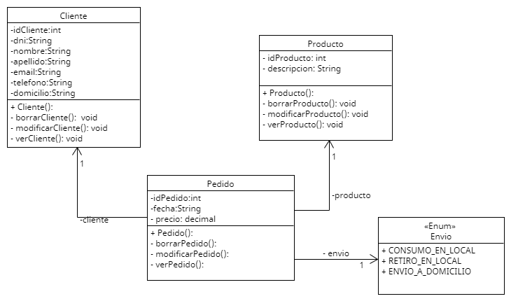

# Documentación

## Clase `Cliente`:

### Atributos:
- `idCliente` (tipo: `int`): identificador único del cliente.
- `dni` (tipo: `String`): número de documento de identidad del cliente.
- `nombre` (tipo: `String`): nombre del cliente.
- `apellido` (tipo: `String`): apellido del cliente.
- `domicilio` (tipo: `String`): domicilio del cliente.
- `email` (tipo: `String`): dirección de correo electrónico del cliente.
- `telefono` (tipo: `String`): número de teléfono del cliente.

### Métodos:
- `Cliente()`: constructor de la clase Cliente que recibe como parámetros los atributos necesarios para inicializar un objeto Cliente.
- `borrarCliente()`: método que permite eliminar el cliente.
- `modificarCliente()`: método que permite modificar el cliente.
- `verCliente()`: método que muestra los detalles del cliente seleccionado.

## Clase `Pedido`:

### Atributos:
- `idPedido` (tipo: `int`): identificador único del pedido.
- `fecha` (tipo: `Date`): fecha de realización del pedido.
- `producto` (tipo: `Producto`): producto que se solicita.
- `cliente` (tipo: `Cliente`): cliente que solicita el pedido.
- `precio` (tipo: `decimal`): precio del pedido.
- `envio` (tipo: `Envio`): forma en la que se recibe el pedido.

### Métodos:
- `Pedido()`: constructor de la clase Pedido que recibe como parámetros los atributos necesarios para inicializar un objeto Pedido.
- `borrarPedido()`: método que permite modificar el pedido.
- `modificarPedido()`: método que permite modificar el pedido.
- `verPedido()`: método que muestra los detalles del pedido.

## Clase `Producto`:

### Atributos:
- `idPedido` (tipo: `int`): identificador único del producto.
- `descripcion` (tipo: `String`): descripción del producto comercializado.

### Métodos:
- `Producto()`: constructor de la clase Producto que recibe como parámetros los atributos necesarios para inicializar un objeto Producto.
- `borrarProducto()`: método que permite eliminar el producto.
- `modificarProducto()`: método que permite modificar el producto.
- `verProducto()`: método que muestra los detalles del producto.

## Enum `Envio`:

### Valores:
+ ENVIO_A_DOMICILIO
+ RETIRO_EN_LOCAL
+ CONSUMO_EN_LOCAL
